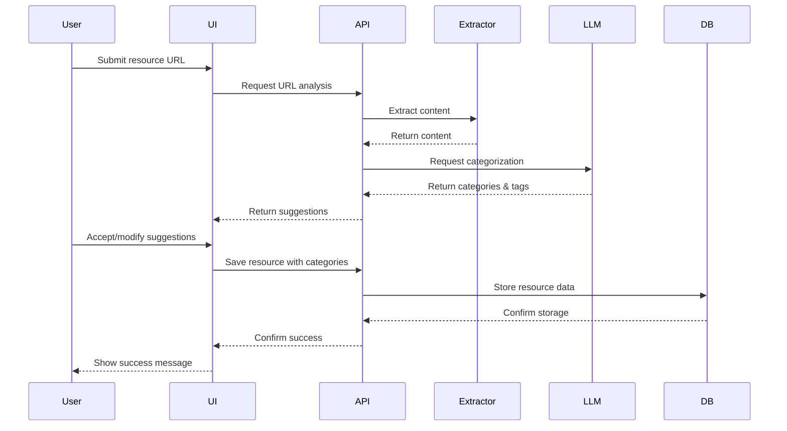

# LullAIbot Education App - LLM Integration Plan

This document outlines the approach for integrating Large Language Models (LLMs) into the LullAIbot Education App, focusing primarily on the categorization of resources.

## Goals of LLM Integration

1. **Automatic Resource Categorization**: Suggest appropriate categories for newly added resources
2. **Tag Generation**: Extract relevant tags from resource content
3. **Summary Generation**: Create concise summaries of resource content
4. **Content Relevance Scoring**: Assess resource quality and relevance to AI education
5. **Search Enhancement**: Improve search results using semantic understanding

## LLM Selection Criteria

| Criteria | Priority | Description |
|----------|----------|-------------|
| Accuracy | High | Precision in categorization and tagging |
| Cost | Medium | Budget-friendly pricing for production usage |
| Latency | Medium | Response time fast enough for good UX |
| Context Length | Medium | Ability to process longer resource content |
| Fine-tuning Capabilities | Low | Option to customize for specific domains |
| Security | High | Data privacy and security guarantees |

## LLM Options Comparison

| Model | Pros | Cons | Cost Estimate | Recommended Use Case |
|-------|------|------|---------------|----------------------|
| OpenAI GPT-4 | High accuracy, comprehensive knowledge | Higher cost, potential rate limiting | $0.03-0.06/1K tokens | High-value categorization, complex content analysis |
| OpenAI GPT-3.5 | Good accuracy, lower cost | Less nuanced understanding | $0.002/1K tokens | Standard categorization, tag generation |
| Anthropic Claude | Strong reasoning, longer context | Higher cost, fewer integrations | $0.008-0.024/1K tokens | Extended content analysis, summaries |
| Llama 2 (Self-hosted) | One-time cost, no usage fees | Lower accuracy, requires maintenance | Hardware costs only | Development environment, backup service |
| Hugging Face Models | Open source, customizable | Requires expertise to deploy | Infrastructure costs | Custom task-specific implementations |

## Selected Approach

For the initial implementation, we recommend using **OpenAI GPT-3.5 Turbo** as the primary LLM with the following configuration:

- API: OpenAI API
- Primary tasks: Resource categorization, tag generation
- Model parameters: 
  - Temperature: 0.3 (lower creativity, higher determinism)
  - Top-p: 0.8
  - Max tokens: 150 for categorization responses

For content analysis requiring more depth (longer articles, academic papers), we'll use **Anthropic Claude** due to its higher context window capabilities.

## Test Prompts for Resource Categorization

### Basic Categorization Prompt

```
You are an AI assistant for a resource library focused on artificial intelligence and machine learning education.

Given the following resource information, suggest the most appropriate categories from the list below. Provide a confidence score between 0 and 1 for each suggested category.

Resource Title: {title}
Resource Description: {description}
Resource URL: {url}

Available Categories:
- Beginner Resources
- Intermediate Resources 
- Expert Resources
- General AI Concepts
- Getting Started Guides
- Developer Resources
- Project Management Resources
- Content Creation Resources
- Advanced Technical Resources
- Security and Best Practices

Respond in JSON format:
{
  "categories": [
    {
      "category": "Category Name",
      "confidence": 0.95
    },
    ...
  ]
}
```

### Enhanced Categorization with Content Extraction

```
You are an AI assistant for a resource library focused on artificial intelligence and machine learning education.

I will provide you with a resource title, description, and extracted content. Your task is to:
1. Identify the most appropriate categories for this resource
2. Suggest relevant tags
3. Provide a brief (50 words max) summary of the resource

Resource Title: {title}
Resource Description: {description} 
Extracted Content: {content}

Available Categories:
[List of all categories]

Respond in JSON format:
{
  "categories": [
    {
      "category": "Category Name",
      "confidence": 0.95
    },
    ...
  ],
  "tags": ["tag1", "tag2", "tag3", ...],
  "summary": "Brief summary of the resource"
}
```

## Performance Metrics

To evaluate the effectiveness of the LLM integration, we'll track the following metrics:

1. **Categorization Accuracy**: Percentage of correct category assignments compared to human validation
2. **Tag Relevance**: Percentage of generated tags deemed relevant by users
3. **User Acceptance Rate**: Percentage of LLM suggestions accepted by users
4. **Processing Time**: Average time to process a resource
5. **Cost per Resource**: Average API cost for processing a single resource

## Implementation Phases

### Phase 1: Proof of Concept
- Implement basic categorization API endpoint
- Test with sample resources
- Compare results with manual categorization
- Refine prompts based on results

### Phase 2: MVP Integration
- Integrate categorization into resource submission flow
- Implement tag generation
- Create user interface for accepting/rejecting suggestions
- Add logging for performance metrics

### Phase 3: Advanced Features
- Implement content extraction from URLs
- Add summary generation
- Enhance search with semantic understanding
- Create batch categorization for existing resources

### Phase 4: Optimization
- Analyze usage patterns and costs
- Fine-tune prompts for better performance
- Evaluate alternative models for cost/performance
- Implement caching for similar resources

## Technical Implementation

### URL Content Extraction

1. Use a headless browser solution (e.g., Puppeteer) to extract content from URLs
2. Implement selective content extraction to focus on main article content
3. Process HTML to extract clean text (remove ads, navigation, etc.)
4. Implement rate limiting and error handling for external site access

### Integration Flow



## Cost Estimates

Based on an estimate of 100 new resources per month:

| Service | Usage | Monthly Cost |
|---------|-------|--------------|
| Content Extraction | 100 URLs | Negligible (self-hosted) |
| GPT-3.5 API | 100 categorizations (~2,000 tokens each) | $0.40 |
| Claude API (for long content) | 20 analyses (~10,000 tokens each) | $4.00 |
| Total | | ~$4.40 |

## Fallback Mechanisms

In case of API failures or unreasonable results:

1. **Service Unavailable**: Switch to backup model or queue for later processing
2. **Low Confidence Results**: Prompt user for manual categorization
3. **Excessive Costs**: Implement stricter caching and throttling
4. **Rate Limiting**: Implement queuing system with priority processing

## Privacy and Security Considerations

1. **Content Processing**: Only send necessary data to LLM API
2. **User Content**: Never associate user identifiers with LLM requests
3. **API Keys**: Secure storage of API keys in environment variables
4. **Data Retention**: Clear extracted content after processing

## Next Steps

1. Set up development accounts for OpenAI and Anthropic
2. Implement proof-of-concept endpoints using test resources
3. Conduct accuracy testing with sample dataset
4. Refine prompts based on initial results
5. Create UI components for displaying and managing suggestions

## Success Criteria

The LLM integration will be considered successful if:

1. Categorization accuracy exceeds 85% compared to human reviewers
2. Tag relevance rate exceeds 80%
3. User acceptance rate of suggestions exceeds 75%
4. Processing time remains under 5 seconds per resource
5. Monthly costs remain within budget ($10/month maximum) 