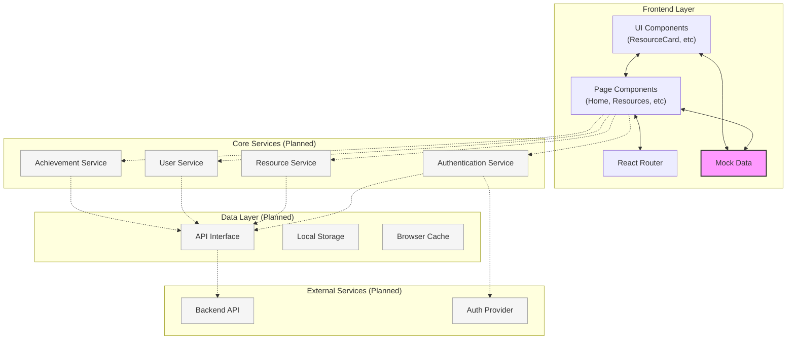

# LullAIbot Education App - System Architecture

This document outlines the system architecture of the LullAIbot Education App, which is a React-based web application for managing educational resources related to AI/ML.

## Architecture Diagram



## Current Implementation

The LullAIbot Education App is currently implemented as a frontend-only React application with the following components:

### Frontend Layer
- **UI Components**: Reusable UI elements including:
  - Layout.tsx: Main layout wrapper with navigation
  - ResourceCard.tsx: Card component for displaying resource items
- **Page Components**: Main view components including:
  - HomePage.tsx: Dashboard with recent resources and user stats
  - ResourcesPage.tsx: Browsing and searching resources
  - AddResourcePage.tsx: Form for adding new resources
  - AchievementsPage.tsx: User achievements display
  - LeaderboardPage.tsx: Ranking of user contributions
- **React Router**: Handles navigation and URL routing via react-router-dom
- **Mock Data**: Static data used for development (mockResources.ts)

## Planned Architecture

As the application matures, it will evolve to include the following components:

### Core Services (Planned)
- **Authentication Service**: Will handle user login, registration, and session management
- **Resource Service**: Will manage resource data (fetching, adding, updating)
- **User Service**: Will handle user profile and preferences
- **Achievement Service**: Will manage user achievements and gamification

### Data Layer (Planned)
- **API Interface**: Will provide a consistent interface for backend communication
- **Local Storage**: Will persist user settings and cached data
- **Browser Cache**: Will improve performance by caching resources

### External Services (Planned)
- **Backend API**: Server-side API that will provide data and business logic
- **Auth Provider**: External authentication service (if applicable)

## Data Flow

### Current Data Flow
1. User navigates to a page through the Router
2. Page components access mock data directly
3. UI components receive data as props from parent components
4. User interactions update local component state

### Planned Data Flow
1. User navigates to a page through the Router
2. Page components request data from Core Services
3. Services check local cache/storage first
4. If needed, services make API requests to external Backend
5. Data is passed to components for rendering
6. User interactions trigger state updates
7. State changes propagate to relevant components

## Current File Structure

```
lullaibot.edu/
├── src/
│   ├── components/      # Reusable UI components
│   │   ├── Layout.tsx
│   │   ├── ResourceCard.tsx
│   │   └── ...
│   ├── pages/           # Page components
│   │   ├── HomePage.tsx
│   │   ├── ResourcesPage.tsx
│   │   ├── AddResourcePage.tsx
│   │   ├── AchievementsPage.tsx
│   │   ├── LeaderboardPage.tsx
│   │   └── NotFoundPage.tsx
│   ├── data/            # Mock data
│   │   └── mockResources.ts
│   ├── styles/          # CSS styles
│   │   ├── index.css
│   │   ├── layout.css
│   │   ├── forms.css
│   │   └── ...
│   ├── assets/          # Static assets
│   ├── main.tsx         # Application entry point
│   └── App.tsx          # Main application component
├── public/              # Static assets
├── docs/                # Documentation
└── ...
```

## Technologies Used

- **React**: UI library
- **TypeScript**: Type-safe JavaScript
- **React Router**: Navigation
- **CSS Modules**: Component styling
- **Vite**: Build tool and development server

## Future Enhancements

1. **Phase 1: State Management**
   - Implement Context API or Redux for global state management
   - Create service layer abstraction

2. **Phase 2: Backend Integration**
   - Develop REST API endpoints
   - Connect frontend to backend services
   - Implement error handling and loading states

3. **Phase 3: Authentication**
   - Add user authentication system
   - Implement role-based access control

4. **Phase 4: Advanced Features**
   - Add search functionality with filtering
   - Implement real-time updates
   - Develop offline support
   - Add analytics tracking 